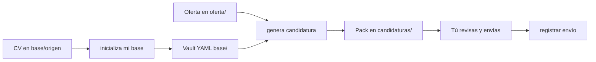

# CV Toolkit

[](https://www.python.org/downloads/)
[](LICENSE)
[](docs/usar.md)

> Adapta un CV **ATS de una columna** a cada oferta desde un vault YAML. El agente prepara el pack; **tú envías** al portal.

Privacidad: `base/` contiene teléfono, email e historial — mantén **tu copia privada**.


## Qué es / Qué no es

| Sí | No |
|---|---|
| Vault de hechos + match go/no-go | Autoaplicar a InfoJobs / LinkedIn |
| PDF/DOCX ATS 1 columna + carta + outreach | Inventar experiencia o métricas |
| Skills del agente (`inicializa…`, `genera…`) | Subir tu vault a la nube |


## Cómo funciona




## Empezar en 5 minutos

```bash
python3 -m venv .venv
.venv/bin/pip install -r requirements.txt
.venv/bin/python scripts/cvtool.py doctor
```

Si `doctor` falla en PDF / WeasyPrint → [Instalación](docs/usar.md#instalación).

1. Copia tu CV a [`base/origen/curriculum.md`](base/origen/curriculum.md) (o PDF con texto seleccionable). Si tienes presentación (carta o bio), déjala también en [`base/origen/presentacion.md`](base/origen/presentacion.md).
2. En tu agente: **inicializa mi base**.
3. Pega la oferta en [`oferta/descripcion.md`](oferta/descripcion.md) (o una URL pública Greenhouse/Ashby/Lever) → **genera candidatura**.
4. Revisa, **aprueba** el pack y envía tú el PDF/DOCX de `cv/` o `candidaturas/…`.
5. Di **registrar envío**.

¿Sin CV a mano? `sh scripts/demo_smoke.sh` o [`ejemplos/`](ejemplos/README.md).


## Frases al agente

| Cuándo | Escribe |
|---|---|
| Primera vez | **inicializa mi base** |
| Oferta en `oferta/` | **genera candidatura** |
| Ya enviaste | **registrar envío** |
| Cambió un hecho | **actualizar base** |


## Qué obtienes

| Archivo | Uso |
|---|---|
| `cv/curriculum.pdf` / `.docx` | Último CV ATS |
| `cv/CV_Nombre_Puesto_Empresa.*` | Nombre de envío |
| `cv/presentacion.md` | Carta (≤250 palabras) |
| `cv/outreach.md` | Borrador de mensaje (tú envías) |
| `candidaturas/YYYY-MM-DD_…/` | Pack congelado + briefing + factcheck |
| `candidaturas/tablero.yaml` | Seguimiento |


## Más

- [Guía de uso](docs/usar.md) — instalación, bucle diario, veredicto, envío, CLI, FAQ
- [Ejemplos](ejemplos/README.md) — demo sin tu CV
- [AGENTS.md](AGENTS.md) — router del agente / skills
- [Desarrollar el kit](docs/desarrollar.md) — tests, SPEC, SHIELD
